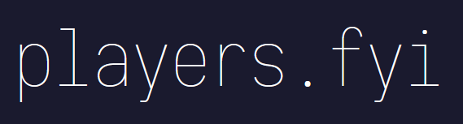

A nice, small, and simple front-end built with Next.js, Material UI, and Recharts to showcase some data I've been collecting for some reason.

### Quirks
- Completely static (regenerates daily -> [read more](https://nextjs.org/blog/next-9-5#stable-incremental-static-regeneration))
- Simple example of self-hosting fonts with Material UI
- Customised Rechart components

### What data?
Tracking library -> [tracula](https://github.com/J-Leg/tracula)

### Deployment
To be deployed on Vercel.
